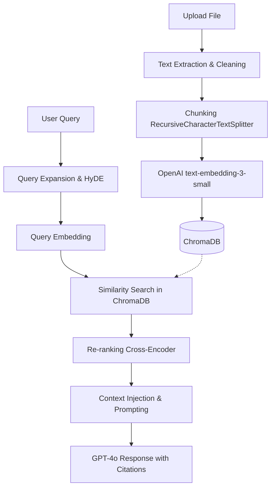

# SRMDOCSAFE AI - AI Architecture & Production Strategy (Phase 5)

## 1. AI CORE SYSTEM PIPELINE

### Processing Flow
1. **OCR Engine (Tesseract/PyMuPDF)**
   - *Input*: File Bytes.
   - *Process*: PyMuPDF for native PDFs. Fallback to Tesseract OCR for images/scanned PDFs.
   - *Output*: Clean Extracted Text.
   - *Error Handling*: Retry with image enhancement (OpenCV) if confidence < 70%.
2. **Classification Engine (GPT-4o-mini)**
   - *Input*: First 500 words of extracted text.
   - *Process*: Zero-shot classification via OpenAI JSON schema.
   - *Output*: Category (Marksheet, Notes, Notice, etc.).
3. **Summarization Engine (GPT-4o-mini)**
   - *Process*: Map-Reduce strategy for long documents to bypass token limits.
4. **AI Tagging & Deadline Extraction**
   - *Process*: Uses function-calling (tools) to force the LLM to output structured arrays of tags and ISO-8601 dates.
5. **Study Notes & Quiz Engine**
   - *Trigger*: On-demand by user.
   - *Process*: RAG context retrieval -> System prompt specializing in pedagogy -> Output.

## 2. RAG SYSTEM ARCHITECTURE

A production-grade Retrieval-Augmented Generation pipeline.

### Advanced Strategies
- **Chunking**: 512 tokens with 50-token overlap. Uses markdown-aware splitting.
- **Retrieval**: Hybrid search (Dense Vector + BM25 keyword search) to ensure exact terms (e.g., "MTH101") aren't lost in semantic space.
- **Hallucination Reduction**: Strict prompt injection: "Answer ONLY using the provided context. If the context does not contain the answer, state 'The document does not specify'."
- **Source Citations**: LLM is instructed to append `[Chunk-ID]` to facts. Frontend maps this to the original PDF page.

## 3. ADVANCED AI FEATURES

### AI Exam Preparation Mode
- **Flow**: User selects document -> Clicks "Prep Mode".
- **Pipeline**: Retrieves entire document -> LLM extracts entities -> Generates 1) Flashcards, 2) Important Questions, 3) 1-Page Cheatsheet.

### AI Research Assistant
- **Flow**: User uploads `.pdf` classified as "Research Paper".
- **Pipeline**: Specific prompt template extracts: Abstract Summary, Methodology, Datasets used, and Future Scope.

### Smart Timeline & Knowledge Graph
- **Timeline**: `Deadline Extraction Engine` pipes dates into a global user timeline table, displayed chronologically on the dashboard.
- **Knowledge Graph**: Every AI Tag generated creates nodes. Edges are weighted by co-occurrence. Frontend renders this using `react-force-graph`.

## 4. PRODUCTION READINESS

1. **Logging & Monitoring**: Datadog or Sentry for capturing exception stack traces. Logging via Python's `logging` module pushing to ELK stack or Grafana Loki.
2. **Error Tracking Strategy**: Unique Request IDs attached to all logs. Specific Slack alerts for AI API failures.
3. **Caching**: Redis caching for frequent queries (e.g., getting the dashboard timeline or fetching existing summaries) to avoid DB hits.
4. **API Optimization**: Use `asyncio` for all external API calls (OpenAI) so the FastAPI event loop is never blocked.
5. **Security**: Implement rate-limiting via Redis (`fastapi-limiter`) to prevent OpenAI API abuse and bankruptcy.
6. **Cost Optimization**: 
   - Hash documents to prevent re-embedding identical files.
   - Use `gpt-4o-mini` for 90% of tasks, only using `gpt-4o` for complex reasoning.
   - Cache exact query matches.
