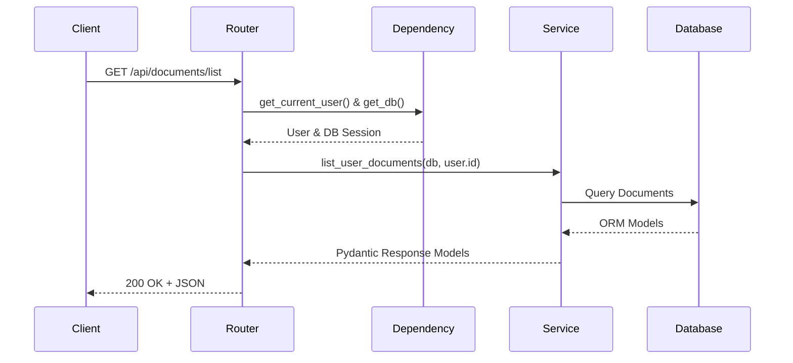
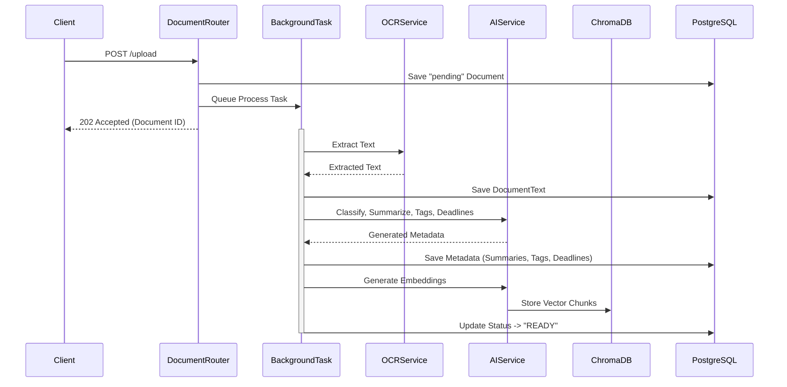

# SRMDOCSAFE AI - Backend Architecture (Phase 3)

## 1. Complete Backend Architecture
The backend is built using a modern **Layered Architecture** with **Dependency Injection** in FastAPI. It ensures separation of concerns, scalability, and testability.

- **Controllers (API Routers)**: Handle HTTP requests, input validation (Pydantic), and HTTP responses.
- **Service Layer**: Contains core business logic. Separated into specialized domains (AuthService, DocumentService, AIService). 
- **Repository Layer / Data Access**: SQLAlchemy ORM for database interaction.
- **Background Task Workers**: FastAPI `BackgroundTasks` (or Celery for production scaling) handles heavy AI operations asynchronously.
- **External Integration**: OpenAI API, ChromaDB Vector DB, Tesseract OCR.

## 2. Request Flow (Standard)

## 3. Processing Flow (Background Task)

## 4. Service Interactions
- **DocumentService** relies on **AuthService** (for permissions) and spawns tasks in **ProcessingService**.
- **ProcessingService** acts as the orchestrator. It calls **OCRService**, then pipes the output to **ClassificationService**, **SummaryService**, **AITaggingService**, and **EmbeddingService**.
- **RAGService** handles chat endpoints. It uses **EmbeddingService** to embed user queries, queries ChromaDB, and uses OpenAI to generate responses based on retrieved context.

## 5. Module Explanations
- **Auth Module**: Handles JWT encoding/decoding, password hashing using `passlib`, and provides `get_current_user` dependencies for route protection.
- **Document Module**: Handles physical file storage (local OS paths for MVP), calculates SHA-256 hashes for duplicate detection, and manages the lifecycle in PostgreSQL.
- **AI Processing Services**: Specialized Python classes wrapping OpenAI and Tesseract. Each service has a single responsibility (e.g., `SummaryService` only generates summaries).
- **Background Workflow**: Avoids blocking the event loop. Uploads return instantly while processing runs in the background. The client can poll the document status or use WebSockets (future enhancement) to know when processing is complete.
