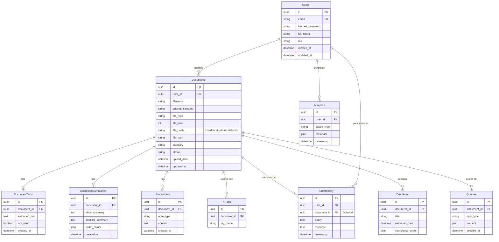

# Database Architecture & ER Design

## Entity Relationship Diagram (ERD)

## Relationships Explained
1. **Users -> Documents (1:N)**: A user can upload many documents. A document belongs to one user.
2. **Documents -> DocumentTexts (1:1)**: Extracted raw text is stored separately to keep the main Documents table lightweight.
3. **Documents -> DocumentSummaries (1:1)**: Contains AI-generated summaries. Separated for performance when querying document metadata.
4. **Documents -> StudyNotes (1:N)**: An AI can generate multiple types of study notes (e.g., Revision, Flashcards) for a single document.
5. **Users -> ChatHistory (1:N)**: A user can have many chat interactions.
6. **Documents -> ChatHistory (1:N)**: A chat query may be contextually linked to a specific document.
7. **Users -> Analytics (1:N)**: Tracks user actions (uploads, chats, exports).
8. **Documents -> AITags (1:N)**: Smart tags assigned to a document by AI for better semantic search and filtering.
9. **Documents -> Deadlines (1:N)**: Extracted deadlines from notices and circulars.
10. **Documents -> Quizzes (1:N)**: Generated assessments based on document content.

## Why Each Table Exists
- **Users**: Core authentication and identity management.
- **Documents**: Central hub for all file metadata. Includes `file_hash` to detect duplicates across the system (saving storage and processing costs).
- **DocumentTexts**: Holds potentially massive text blobs from OCR. Kept out of `Documents` so that list queries remain extremely fast.
- **DocumentSummaries**: Stores structured summaries to avoid re-generating them and saves AI token costs.
- **StudyNotes**: Stores generative study material.
- **ChatHistory**: Audit log and context for RAG conversations.
- **Analytics**: For the Career Insights and usage dashboard, providing telemetry on how the user is interacting with the system.
- **AITags**: Facilitates filtering and basic keyword search on top of vector search.
- **Deadlines**: Specific to student workflows, allowing the UI to surface a "Upcoming Deadlines" widget directly from documents.
- **Quizzes**: Stores generated quizzes so students can take them multiple times without re-generating.
